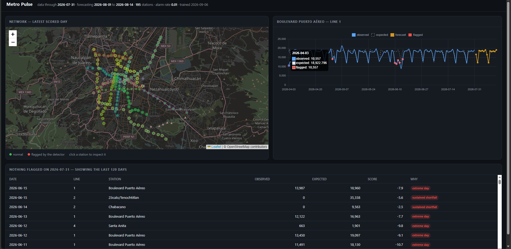

# Metro flow

Demand forecasting and operational anomaly detection for the Mexico City Metro,
built on the city's open ridership data: 
Two things come out of one model of expected demand:

1. **A 14-day demand forecast per station** — for allocating trains, staffing
   turnstiles and planning fare-card stock.
2. **An incident detector** — the Metro publishes no real-time incident feed, so
   a station whose ridership collapses has to be found by noticing that it did.

## Results



Everything below is measured out-of-sample. Nothing is fitted on a day it is
scored on, and there is a [test suite](tests/test_no_leakage.py) that proves it
by replacing the future with noise and requiring the forecasts not to move.

### Forecasting — 12 rolling-origin folds, 14-day horizon

| model | MAE | sMAPE | MASE | vs. baseline |
|---|---:|---:|---:|---:|
| **LightGBM, global** | **1,194** | **7.52%** | **0.435** | **0.727** |
| Seasonal naive (baseline) | 1,768 | 11.09% | 0.644 | 1.000 |
| Hierarchical seasonal | 1,762 | 10.92% | 0.642 | 1.025 |

The learned model beats the baseline in **11 of 12 folds** and at **all 14
horizons**, cutting mean absolute error by **32%**.

The baseline is not a straw man. Metro demand is overwhelmingly weekly, so "the
same weekday last week" is a real forecast — which is exactly why it is the
denominator here rather than a naive mean.

The labels are real. The service mask derived from the data records every day
each station was out of service across sixteen years, so recall is measured
against the Line 12 collapse, the Line 1 modernization, the control-centre fire
and the pandemic closures, rather than against synthetic injections.

The threshold is a target false-alarm rate, not a fixed number of sigmas, so the
alert volume is a design decision:

| false alarm rate | alerts/day | precision | **onset recall (≥4-day interruptions)** |
|---:|---:|---:|---:|
| 0.0005 | 2.0 | 0.83 | 39.4% |
| 0.002 | 3.2 | 0.71 | 64.5% |
| **0.010** | **6.3** | **0.45** | **88.2%** |
| 0.050 | 16.2 | 0.20 | 96.6% |

At roughly six alerts a day across 195 stations, **88% of genuine service
interruptions are flagged within three days of starting**.

The CUSUM restarts once it fires. Without that, a station shut for two months
accumulates a shortfall so deep that it keeps alarming for weeks after it
reopens and its daily numbers are perfectly ordinary — which is exactly what the
dashboard showed the first time it was rendered, six of seven "current" alerts
being stations whose incident had ended. Restarting cut the alert volume by a
third and raised precision from 0.34 to 0.45 while costing two points of recall:
what it removed was the same incident reported over and over.

*Onset* recall is the honest metric: flagging day four hundred of a two-year
closure is worth nothing to anybody, and it does not count here. Precision is a
lower bound — a "false positive" may well be a real incident (a march, a flood,
a partial failure) that never became a recorded closure.

## What the data turned out to be

Most of the engineering in this project is in the four paragraphs below. The
modelling was the easy part.

**The line column holds 24 values for 12 lines.** The 2021–2023 slice of the
panel is mojibake: its UTF-8 bytes were decoded as latin-1 and re-encoded, so
the file literally stores `Línea 1` where it means `Línea 1`. Stripping accents
does not merge the two spellings — the text has to be repaired
(`encode("latin-1").decode("utf-8")`) before it is normalized. Without that step
every series silently splits in two across the most eventful years in the
record.

**5.3% of rows report zero ridership, and none of them are demand.** They are
the operating history of the network, written into the measurement column:

| period | station-days | what they are |
|---|---:|---|
| 2010-01 → 2012-11 | 20,780 | Line 12 padded with zeros before it opened |
| 2014-03 → 2015-11 | 6,748 | Line 12 closed for track rehabilitation |
| 2017-09-20 → 09-27 | 1,560 | the 19 September earthquake |
| 2020-04 → 2020-06 | 2,095 | pandemic station closures |
| 2021-05 → 2024-01 | 15,545 | the Olivos overpass collapse |
| 2022-07 → 2025-11 | 10,978 | the Line 1 modernization, in two phases |

Training on those as if they were demand teaches a model to predict closures.
[`clean/service.py`](src/metro_pulse/clean/service.py) classifies every
station-day before anything else happens, and the threshold that separates a
closure from an incident (4 days) sits in the natural gap in the run-length
distribution: 182 zero runs last exactly one day and 97 last two or three, but
only 14 last four to six.


**The earthquake was not a closure.** For eight days in September 2017 *every*
station in the network reports zero. The Metro did not carry zero passengers; it
did not count them. That distinction has to be made, or the model learns from a
week of fabricated zeros — and the same rule correctly leaves the four Line 12
stations that stayed shut for another month labelled as closed.

**Sixty-two rows have a lost label.** Throughout December 2020 the Line B row
for *Deportivo Oceanía* is labelled *Oceanía*, so that month has two `Oceanía`
rows a day and no `Deportivo Oceanía` row. Neither magnitude nor file order
resolves which is which — in November the two stations are not even written in a
consistent order within a day. They are flagged rather than guessed at: kept in
the panel, excluded from training, evaluation and lag features.

## How it works

```
ingest/     resolve the CKAN resource by name, download, validate the schema
clean/      repair labels, derive the service mask, emit a rectangular panel
features/   calendar effects and origin-anchored lags -> supervised table
models/     baselines and the detector in numpy; LightGBM for the forecaster
backtest/   rolling-origin folds, metrics, and the walk-forward detector evaluation
```

**The panel is strictly rectangular** — 195 line-station pairs × 6,056 days,
which is exactly the row count of the source file. Closed days stay in it as
`NaN` rather than being dropped, because dropping them would shift every lag by
however many days a station was shut.

**Baselines and the detector are written out in numpy**, not imported: the
seasonal naive, a robust multiplicative decomposition (level × weekday × month,
estimated with medians so that a two-year closure cannot drag the level), a
MAD-scaled z-score and a one-sided CUSUM. The forecaster is LightGBM, trained
with an `l1` objective because it is scored on mean absolute error.

**One model serves all 195 series**, with the station and line as features and
the horizon as a feature too. A station reopening after a two-year closure
inherits everything the network knows about Sundays and holidays instead of
starting from its own empty history.

### Two limits worth stating up front

*The forecast horizon is planning, not real time.* The source publishes monthly
with about a month of lag; today it reaches 31 July 2026. This forecasts demand
for staffing and scheduling, not for a passenger deciding which train to catch.

*There is no hourly data.* Public ridership is daily, which puts "which hour is
least crowded" out of reach. It is not attempted.

## Design decisions

**Repairing the mojibake rather than mapping it.** The fix is
`text.encode("latin-1").decode("utf-8")` wrapped in a `try`, and it is chosen
because it is self-verifying: text that is already correct has no latin-1
encoding of its UTF-8 bytes, fails the round trip and comes back untouched. So
it can be applied to every value without knowing in advance which ones are
broken. A hand-written substitution table would work today and break the next
time the portal publishes a new station with the same defect.

**Deriving the service mask from the data rather than from a list of events.**
A hand-maintained event log would need editing for every future closure, and —
more importantly — evaluating the detector against the same list that produced
the mask would be circular. Because the mask is derived, the documented events
become an *independent* ground truth for measuring recall. The four-day
threshold that separates a closure from an incident is not a guess either: the
run-length distribution has a gap there, with 182 runs of exactly one day, 97 of
two or three, and only 14 of four to six.


**A strong baseline, on purpose.** Metro demand is dominated by the day of the
week, so "the same weekday last week" is a genuinely good forecast. Picking a
weak baseline is the most common way a forecasting project flatters itself.
Two skill numbers are reported because they answer different questions: `mase`
is the textbook figure, comparable with the literature, while `relative_mae` is
measured against the baseline *on the same days* and therefore equals exactly
1.0 for the baseline — a verifiable invariant rather than a claim.

**One global model, not 195 local ones.** Per-station models would be 195 models
of ~6,000 rows each, none able to learn that Sundays are quiet from anything but
its own history. The global model takes the station identity as a feature, so a
station reopening after a two-year closure inherits what the network knows about
Sundays and holidays. The objective is `l1` because the score is mean absolute
error: training on squared loss and reporting absolute error optimises one thing
and reports another, and in data this full of outliers the squared loss chases
them.

**An alarm threshold read off the data, not off the normal distribution.** The robust
z-score has a standard deviation near 1.8 and very heavy tails. It also ruled
out the obvious suspect — the training and serving distributions almost coincide
(2.77% vs 3.42% below -4), so there was no drift

**Precomputed artifacts instead of a model in the request path.** The source
publishes once a month. Spending CPU per request to recompute an answer that
cannot change until the next release is not engineering. The payoff is concrete:
the image needs no network, no credentials and no training run to build, and
what ships is byte-for-byte the model the quality gate measured.

## Serving

```
GET /forecast?station=pino-suarez&horizon=1   predicted ridership
GET /anomalies?line=3                         what the detector flagged, and why
GET /stations                                 195 pairs, with coordinates
GET /metadata                                 what was trained, on what, through when
GET /health                                   503 until the artifacts are loadable
GET /                                          dashboard        /docs  OpenAPI
```

The dashboard draws the network on a map, colours the stations the detector
flagged today, and plots observed against expected and forecast for whichever
station you click.

**No request ever runs a model.** The source publishes once a month, so the
forecasts and scores are computed once by `models/train.py` and served as static
artifacts; retraining inside a request handler would spend CPU recomputing an
answer that cannot change until the next release. The four serving artifacts
total under half a megabyte and are committed, so the Docker build needs no
network access, no training run and no credentials — and the image that ships is
byte-for-byte the model the backtest measured.

Station coordinates come from a separate dataset the city publishes only as SHP
and KMZ. The KMZ is read with the standard library, and the 195 points are
reconciled against the panel's 195 pairs rather than trusted: two did not match,
and both were worth knowing about — one station has been renamed since the
ridership series was set up, and one is misspelled in the published geometry.
Both live in [`reference/station_aliases.csv`](reference/station_aliases.csv).

## Running it

```bash
python -m venv .venv && .venv/Scripts/activate     # or source .venv/bin/activate
pip install -e ".[dev,api]"

python -m metro_pulse.ingest.download              # download + validate the source
python -m metro_pulse.clean.build                  # canonicalize + service mask
python -m metro_pulse.ingest.geometry              # station coordinates, reconciled
python -m metro_pulse.clean.events                 # the service-event record
python -m metro_pulse.backtest.run                 # forecasting backtest
python -m metro_pulse.backtest.anomaly_eval        # detector operating curve
python -m metro_pulse.models.train                 # fit and write the serving artifacts

uvicorn metro_pulse.api.app:app --port 7860        # or: docker build -t metro-pulse .
pytest                                             # 189 tests
ruff check src tests
```

Every step is idempotent and re-resolves its source through the CKAN API rather
than a stored URL — the portal rotates resource UUIDs, and a stale URL keeps
returning HTTP 200 while serving an HTML error page.

[`deploy/`](deploy/) covers Hugging Face Spaces, Fly.io and Render.

## Keeping it current

`.github/workflows/monthly-retrain.yml` wakes on the 5th of each month, a week
after the portal typically republishes, and walks the whole pipeline. Anything
that has changed upstream stops it: a renamed resource, an altered schema, a new
station, a coordinate that no longer reconciles.

Then it gates. The backtest runs and the job **refuses to publish a model whose
mean `relative_mae` has drifted above 0.95** — one that no longer reliably beats
"the same weekday last week" is not worth shipping, and the point of automating
this is that nobody has to remember to look. Only past the gate does it retrain,
verify the service can load what it wrote, and commit the artifacts.

## Data

- **Ridership** — [Afluencia diaria del Metro CDMX](https://datos.cdmx.gob.mx/dataset/afluencia-diaria-del-metro-cdmx),
  Portal de Datos Abiertos de la CDMX. Daily by line and station since January
  2010, updated monthly.

  There is no second operator to fall back on. The
  [Metrobús panel](https://datos.cdmx.gob.mx/dataset/afluencia-diaria-de-metrobus-cdmx)
  looks like a drop-in — same portal, same cadence, same column names — but it is
  aggregated to the line (`fecha, anio, mes, linea, afluencia`) and has no
  station column at all, so none of this applies to it. The schema check catches
  that on the first run rather than several steps later.
- **Calendar** — Mexican statutory holidays via the `holidays` package, plus Holy
  Week and the year-end break, which are not statutory but empty the network.

The portal's published data dictionary does not match the file it describes: it
declares `dia` and `ano` columns the CSV does not have. The schema enforced here
is the one observed in the file, and it is checked on every ingest.

## License

MIT.
